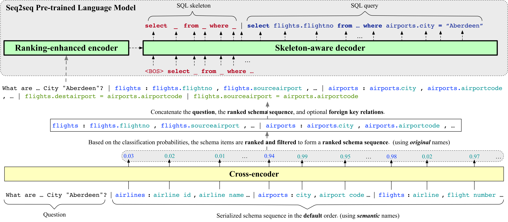

# NL-to-SQL-parser

<p align="left">
    <br>
    
    <br>
<p>

### RESDSQL: Decoupling Schema Linking and Skeleton Parsing for Text-to-SQL


## Prerequisites:
- PyTorch models requires GPU compute capability > 3.7
- Convert your databse into SQLite form using sqlite_converter located in `/files` folder.
- Generate the tables.json file for your datbase(You can use tables_json converter located in `/files` folder).
- Install the required modules and tools using the following commands:


### 1. Set-up virtual anaconda environment:
```sh
conda create -n your_env_name python=3.8.5
```
Active it and install the cuda version Pytorch:
```sh
conda install pytorch==1.11.0 torchvision==0.12.0 torchaudio==0.11.0 cudatoolkit=11.3 -c pytorch
```
Install other required modules and tools:
```sh
pip install -r requirements.txt
pip install https://github.com/explosion/spacy-models/releases/download/en_core_web_sm-2.2.0/en_core_web_sm-2.2.0.tar.gz
python nltk_downloader.py
```
### 2. Create several folders:
```sh
mkdir eval_results
mkdir models
mkdir tensorboard_log
mkdir third_party
mkdir predictions
```
Clone evaluation scripts:
```sh
cd third_party
git clone https://github.com/ElementAI/spider.git
git clone https://github.com/ElementAI/test-suite-sql-eval.git
mv ./test-suite-sql-eval ./test_suite
cd ..
```

### 3. Add data and databse files in the Spider format(https://yale-lily.github.io/spider)
```sh
Download [data] and [database] from: https://iitgnacin-my.sharepoint.com/:f:/g/personal/husainmalwat_iitgn_ac_in/EmKXkgDNYntMkffKcO2N2egBsBbhSz9cXR-EOm6ucS3Giw?e=ZBlEbW
```

### 4. Prepare Checkpoints:


```sh 
text2sql_schema_item_classifier: https://drive.google.com/file/d/1zHAhECq1uGPR9Rt1EDsTai1LbRx0jYIo/view?usp=share_link
```
```sh
text2sql-t5-large - https://drive.google.com/file/d/1-xwtKwfJZSrmJrU-_Xdkx1kPuZao7r7e/view?usp=sharing
###### OR ######
text2sql-t5-base - https://drive.google.com/file/d/1lqZ81f_fSZtg6BRcRw1-Ol-RJCcKRsmH/view?usp=sharing 
```
The checkpoints should be placed in the `models` folder. 


### 5. Run Inference Script
The inference scripts are located in `scripts/inference`. 

```sh
sh scripts/inference/infer_text2sql.sh 
```
The first argument (model scale) can be selected from `[base, large, 3b]` and the second argument (dataset name) can be selected from `[spider, spider-realistic, spider-syn, spider-dk, DB_schema_synonym, DB_schema_abbreviation, DB_DBcontent_equivalence, NLQ_keyword_synonym, NLQ_keyword_carrier, NLQ_column_synonym, NLQ_column_carrier, NLQ_column_attribute, NLQ_column_value, NLQ_value_synonym, NLQ_multitype, NLQ_others, SQL_comparison, SQL_sort_order, SQL_NonDB_number, SQL_DB_text, SQL_DB_number]`.

The predicted SQL queries are recorded in `predictions/{dataset_name}/{model_name}/pred.sql`.


### 6. Run Commandline Ques-Answering

### Commandline IO
```sh
- Step1: Add your database to the datbase folder in the form of SQLite file(You can use mySQL to SQLite converter from `/files`).
- Step2: Generate the tables.json file for your datbase(You can use tables_json converter located in `/files`).
```
```sh
The IO file is located in `/RESDSQL/Files/IO.py`. 

The IO file takes two input: Enter the databse name and inout NL query.
The predicted SQL queries= will be shown on the output screen.

The predicted SQL queries are recorded in `predictions/{dataset_name}/{model_name}/pred.sql`.
```

 